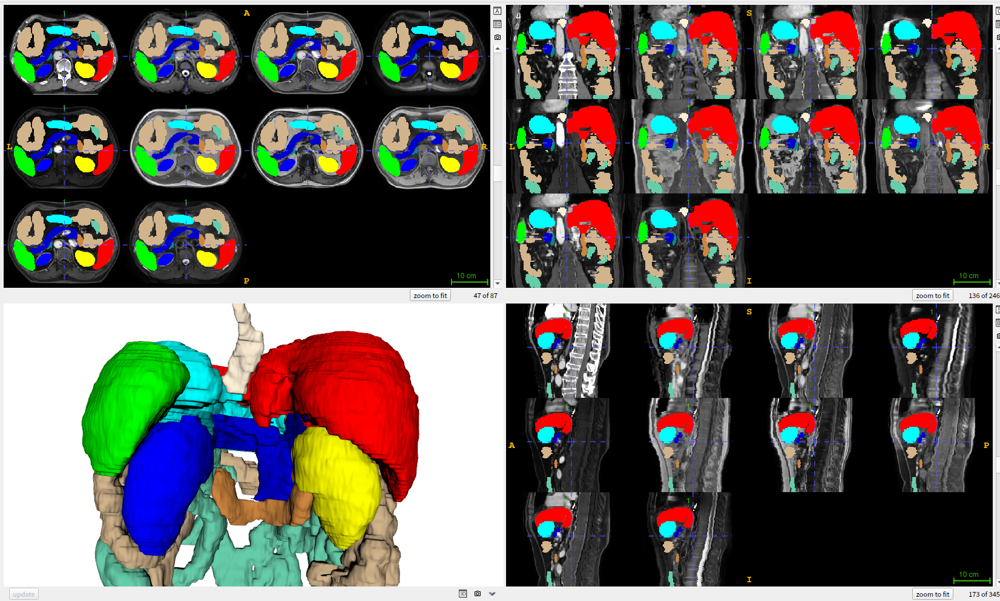
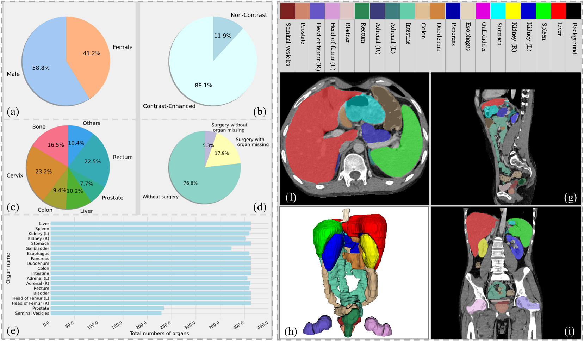

# 
 RAOS

**Now, The real CT and dataset and synthetic MRI have been fully released. Please check here [RAOS](https://drive.google.com/drive/folders/1i2xbXxdEYnjNZVUtGZxYdwaeKmNmywnY?usp=sharing)**

Rethinking Abdominal Organ Segmentation (RAOS) in the clinical scenario: A robustness evaluation benchmark with challenging cases.
* This dataset consists of 413 real clinical CT scans and 413x9 MR scans, all 19 organs were annotated by a senior oncologist (MD. Wenjun Liao, 10 years experiment).
* There are some challenging cases in clinical practice that can help evaluate the generalization and robustness of deep learning methods.
* Some organ annotations not present in previous public datasets (such as prostate, seminal vesicles, etc).

Fig. 1. An example in the dataset (one CT and nine synthesized MR scans).

Fig. 2. Clinical distribution of the dataset.

# DataSet
Don't hesitate to contact Xiangde (luoxd1996 AT gmail DOT com) for the dataset. Two steps are needed to download and access the dataset: **1) using your google email to apply for the download permission ([Goole Driven](https://drive.google.com/file/d/1VJQHvQBWfs1sZ6Nt_6lFK6uEx1YP5QK0/view?usp=drive_link), [BaiduPan](https://pan.baidu.com/s/1N12Rh6jM2NRRlp72J7LlNw))**; **2) using your affiliation email to get the unzip password/BaiduPan access code**. We will get back to you within **two days**, **so please don't send them multiple times**. We just handle the **real-name email** and **your email suffix must match your affiliation**. The email should contain the following information:

    Name/Homepage/Google Scholar: (Tell us who you are.)
    Primary Affiliation: (The name of your institution or university, etc.)
    Job Title: (E.g., Professor, Associate Professor, Ph.D., etc.)
    Affiliation Email: (the password will be sent to this email, we just reply to the email which is the end of "edu".)
    How to use: (Only for academic research, not for commercial use or second-development.)

# Citation
It would be highly appreciated if you cite our paper when using this dataset or code:

    @article{luo2022word,
      title={{WORD}: A large scale dataset, benchmark and clinical applicable study for abdominal organ segmentation from CT image},
      author={Xiangde Luo, Wenjun Liao, Jianghong Xiao, Jieneng Chen, Tao Song, Xiaofan Zhang, Kang Li, Dimitris N. Metaxas, Guotai Wang, and Shaoting Zhang},
      journal={Medical Image Analysis},
      volume={82},
      pages={102642},
      year={2022},
      publisher={Elsevier}}

    @article{luo2024rethinking,
      title={Rethinking Abdominal Organ Segmentation (RAOS) in the clinical scenario: A robustness evaluation benchmark with challenging cases},
      author={Luo, Xiangde and Li, Zihan and Zhang, Shaoting and Liao, Wenjun and Wang, Guotai},
      booktitle={Medical Image Computing and Computer Assisted Intervention -- MICCAI 2021},
      year={2024},
      pages={}}
    }
## Acknowledgment and Statement
* Further details about this work can be found at [here](https://arxiv.org/abs/2406.13674).
* This project will be co-maintained by [Xiangde Luo](https://luoxd1996.github.io) (from UETSC), [Zihan Li](https://huanglizi.github.io/) (from UW) and Wenjun Liao (from Sichuan Cancer Hospital).
